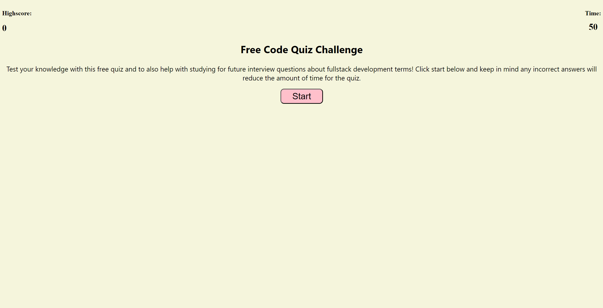
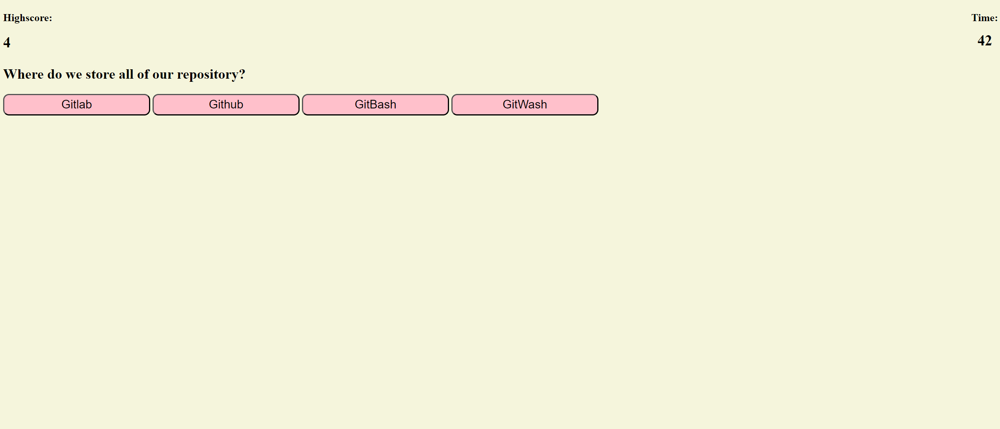
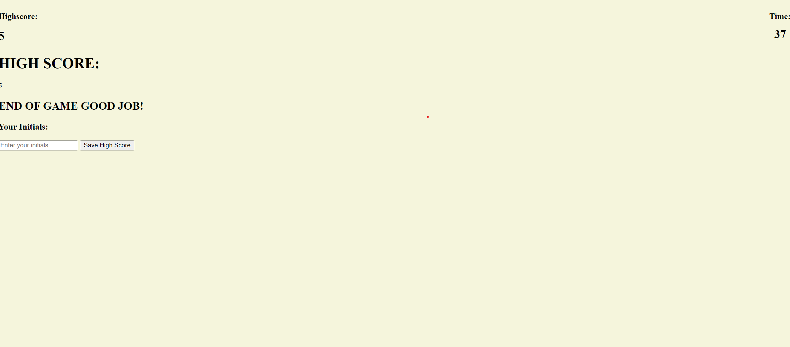

# Mini-Quiz

## Description
This quiz is built to test the user's knowledge on basic questions about coding in general. It asks a total of 5 questions and logs the score on the top left as the user gets the questions right. The main motivation behind this was to test my knowledge on JavaScript and using WebAPIs. Even though there are many areas that may need improvement, I feel this is a stepping stone further into my career.

## Installation
https://github.com/Ericlee1783/Mini-Quiz This link takes us to the code for the Mini Quiz

## Usage
 

These are the screenshots of the quiz once it is deployed. 